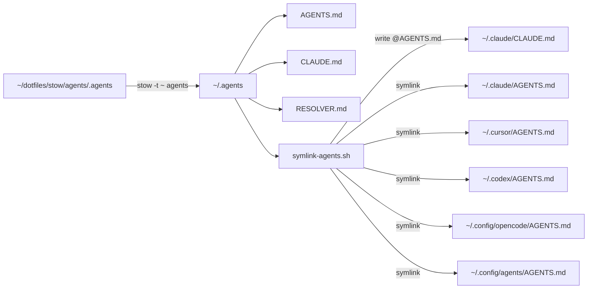

# Agents stow package

Personal agent hub for coding tools on this machine.

Follow ASD-STE100 Simplified Technical English for technical text. These rules apply to all prose you write: docs, commit messages, PR descriptions, reports, replies, etc:
- Use approved words only. Each word has one meaning.
- Use one word for one idea. Do not use two words for the same thing.
- Write short sentences. Use 20 words or less for instructions.
- Use active voice. Write "Turn the switch", not "The switch must be turned".
- Write short paragraphs. Keep one topic in each paragraph.

This `README.md` and `TODO.md` stay in the package only.
Stow ignores them via [`.stow-local-ignore`](../.stow-local-ignore).
Canonical instruction files live under `.agents/` and install to `~/.agents/`.

## Goal

One personal source of truth. Tool paths become thin links into the hub.

Do not put team rules here. Prefer each repo’s own `AGENTS.md`.

## Layout

| Path in package | After stow | Role |
| --- | --- | --- |
| `.agents/AGENTS.md` | `~/.agents/AGENTS.md` | Lean personal defaults |
| `.agents/CLAUDE.md` | `~/.agents/CLAUDE.md` | `@AGENTS.md` shim |
| `.agents/RESOLVER.md` | `~/.agents/RESOLVER.md` | FE / BE / language / repo routing |
| `.agents/symlink-agents.sh` | `~/.agents/symlink-agents.sh` | Wire tools → hub |
| `README.md` | *(ignored)* | This document |
| `TODO.md` | *(ignored)* | Deferred work |

## Architecture

Stow manages only the hub. A small script wires each tool.



### Why this shape

- Stow stays simple: one package, one target tree (`~/.agents`).
- Tool paths differ and change. The script owns that mess.
- One hop from each tool into the hub. Easy to debug.
- Repo overlays and skill trees stay out of v1. See [TODO.md](../TODO.md).

### Config layers

1. **Global personal** — this hub (`~/.agents`), linked into tools.
2. **Project / team** — committed `AGENTS.md`, `CLAUDE.md`, `.cursor/rules`.
3. **Local override** — gitignored `CLAUDE.local.md` / `AGENTS.override.md` in a repo.

## Install

From any directory:

```bash
# 1) Preview hub links
stow -n -v -d "$HOME/dotfiles/stow" -t "$HOME" agents

# 2) Apply hub
stow -v -d "$HOME/dotfiles/stow" -t "$HOME" agents

# 3) Preview tool wiring
"$HOME/.agents/symlink-agents.sh" --dry-run

# 4) Wire tools (interactive on conflicts)
"$HOME/.agents/symlink-agents.sh"
```

Your Stow root already sets `--target=~` in [`stow/.stowrc`](../../.stowrc).
Explicit `-t "$HOME"` keeps the command clear.

### Restow / remove

```bash
stow -R -d "$HOME/dotfiles/stow" -t "$HOME" agents   # restow hub
stow -D -d "$HOME/dotfiles/stow" -t "$HOME" agents   # unstow hub
```

Unstow does not remove tool symlinks created by `symlink-agents.sh`.
Remove those by hand or re-run after you delete unwanted links.

## symlink-agents.sh

| Flag | Meaning |
| --- | --- |
| *(default)* | Create missing tool base dirs, then link. Covers future installs. |
| `--skip-absent` | Only wire tools whose base directory already exists. |
| `--dry-run` | Print actions. Write nothing. |
| `--verify` | Report missing or wrong links. Write nothing. |
| `-h` / `--help` | Help text. |

Conflict prompt when a path already exists and is wrong:

- **s** — skip
- **b** — backup to `*.bak-YYYYMMDDHHMMSS`, then replace
- **a** — abort

Claude special case:

- Write `~/.claude/CLAUDE.md` with exactly `@AGENTS.md` when safe.
- Symlink `~/.claude/AGENTS.md` → `~/.agents/AGENTS.md`.

## Verify

```bash
ls -la ~/.agents
"$HOME/.agents/symlink-agents.sh" --verify
readlink ~/.claude/AGENTS.md ~/.codex/AGENTS.md ~/.cursor/AGENTS.md ~/.config/agents/AGENTS.md
```

Expect hub files to resolve under `~/dotfiles/stow/agents/.agents/`.

## Cursor caveat

Cursor does not yet apply a reliable **global** `AGENTS.md` in all sessions.
Use Cursor User Rules for always-on personal defaults.
Keep project `AGENTS.md` / `.cursor/rules` for repo work.
This package still creates `~/.cursor/AGENTS.md` for forward compatibility.

Forum: [Support global AGENTS.md](https://forum.cursor.com/t/support-global-agents-md/150406).

## Sources for AGENTS.md content

Lean rules came from patterns shared across local repos under `~/code/**`:

- Prefer project docs for facts; keep agent files as conventions.
- Small diffs; no parallel architecture.
- No secrets; no commits unless asked.
- Verify with project checks; keep docs current.
- Progressive disclosure via routers / resolvers.

Workflow modes mirror [Prompt Engineering Cheatsheet](/Users/benoror/vaults/trivelta/Agentic%20Workflows/Prompt%20Engineering%20Cheatsheet.md) (`/research`, `/implement`, `/refactor`, `/test`, `/debug`, `/document`).

Remote review of `benoror@mbp14m4` (`100.104.209.56`) is still pending: Tailscale can show the host active, but SSH to port 22 timed out (likely Remote Login / `sshd` off). See [TODO.md](../TODO.md).

## Related

- Local checklist: vault `Projects/homelab/Bender Mastermind/dotfiles-code(-agents).md`
- Deferred work: [TODO.md](../TODO.md)
