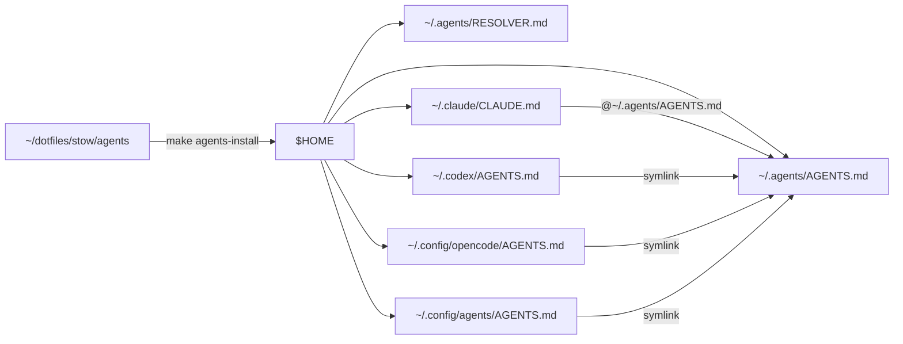

# Agents stow package

Personal agent hub for coding tools.

Follow ASD-STE100 Simplified Technical English for technical text. These rules apply to all prose you write: docs, commit messages, PR descriptions, reports, replies, etc:
- Use approved words only. Each word has one meaning.
- Use one word for one idea. Do not use two words for the same thing.
- Write short sentences. Use 20 words or less for instructions.
- Use active voice. Write "Turn the switch", not "The switch must be turned".
- Write short paragraphs. Keep one topic in each paragraph.

`README.md` and `TODO.md` stay in the package only (see [`.stow-local-ignore`](.stow-local-ignore)).

## Goal

One Stow package installs the hub and tool entrypoints.
No fan-out script. Bootstrap with Make on each machine.

## Layout

| Path in package | After `make agents-install` | Role |
| --- | --- | --- |
| `.agents/AGENTS.md` | `~/.agents/AGENTS.md` | Canonical personal defaults |
| `.agents/RESOLVER.md` | `~/.agents/RESOLVER.md` | Discovery / precedence playbook |
| `.claude/CLAUDE.md` | `~/.claude/CLAUDE.md` | `@~/.agents/AGENTS.md` |
| `.codex/AGENTS.md` | `~/.codex/AGENTS.md` | Symlink → hub |
| `.config/opencode/AGENTS.md` | `~/.config/opencode/AGENTS.md` | Symlink → hub |
| `.config/agents/AGENTS.md` | `~/.config/agents/AGENTS.md` | Generic fallback symlink → hub |

Cursor is **not** part of this package. Use Cursor User Rules for global Cursor prefs.

## Architecture



### Config layers

1. **Global personal** — this package.
2. **Project / team** — committed repo `AGENTS.md` / `CLAUDE.md` / rules.
3. **Local override** — gitignored `CLAUDE.local.md` / `AGENTS.override.md`.

## Bootstrap (new machine)

```bash
git clone <dotfiles-remote> ~/dotfiles
cd ~/dotfiles
make agents-install
make agents-verify
```

Needs GNU Stow. Homebrew: `brew install stow`.

### Day-to-day

```bash
cd ~/dotfiles
make agents-restow    # after package edits
make agents-verify
make agents-uninstall # remove package links only
```

Dry-run before a risky restow:

```bash
stow -n -v -d ~/dotfiles/stow -t ~ agents
```

## Conflicts

If Stow reports a conflict, an existing file already sits at the destination.
Back it up or remove it, then `make agents-restow`.
Do not use `stow --adopt` unless you mean to pull that file into the package.

## Cursor

| Tool | Global mechanism |
| --- | --- |
| Claude Code | `~/.claude/CLAUDE.md` → `@~/.agents/AGENTS.md` |
| Codex | `~/.codex/AGENTS.md` → hub |
| OpenCode | `~/.config/opencode/AGENTS.md` → hub |
| Cursor | User Rules (not this package) |
| Generic | `~/.config/agents/AGENTS.md` → hub |

## Sources for AGENTS.md content

Patterns from:

- `mba15m4:~/code/**`
- `mbp14m4:~/code/**`

Keep the hub lean. Large team standards (e.g. Trivelta) stay in those repos; `RESOLVER.md` only points agents there.

Workflow modes mirror the vault Prompt Engineering Cheatsheet (`/research`, `/implement`, `/refactor`, `/test`, `/debug`, `/document`).

## Related

- Deferred work: [TODO.md](TODO.md)
- Make entrypoints: [../../Makefile](../../Makefile)
