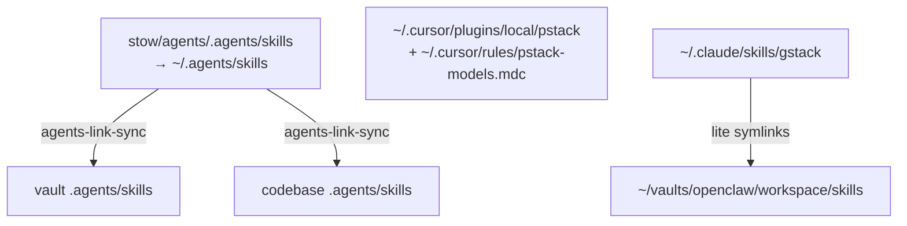

# Agents skill registry

Human map of **where skills live** and **where they end up** after Stow / link / host install.

Prefer this file for reading and planning. Prefer [links.registry](links.registry) for `make agents-link-sync` (machine rows only).

## Naming

| File | Role |
| --- | --- |
| **REGISTRY.md** (this file) | Human catalog: sources, end locations, ownership |
| **links.registry** | Make sync input: which targets get which hub skill symlinks |
| **skills-lock.json** | `npx skills` restore hashes for hub-vendored packs |
| **TOOLS.md** | Avoid here — OpenClaw/Hermes uses that name for *local runtime notes* (SSH, voice, cameras), not skill inventory |

## Surfaces (end locations)



| Surface | End location | How it gets there | Owned by |
| --- | --- | --- | --- |
| Coding hub | `~/.agents/skills/<name>/` | Stow from `stow/agents/.agents/skills/` | This package (git) |
| Vault fan-out | `<vault>/.agents/skills/<name>` → hub | `make agents-link-sync` | Symlink; hub is source |
| Code fan-out | `<repo>/.agents/skills/<name>` → hub | `make agents-link-sync` | Symlink; hub is source |
| Project-local | `<repo>/.agents/skills/<name>/` (real dirs) | `npx skills add …` in that repo | That repo |
| Vault-local | `~/vaults/personal/.agents/skills/<name>/` | Vault tooling (not Stow) | Vault |
| Cursor pstack | `~/.cursor/plugins/local/pstack/` (+ model rule) | Plugin install / local copy | Cursor home (not Stow) |
| gstack (Claude) | `~/.claude/skills/gstack/` | `git clone` + `./setup` | Claude home (not Stow) |
| gstack (OpenClaw lite) | `~/vaults/openclaw/workspace/skills/gstack-openclaw-*` | Symlink → gstack `openclaw/skills/` | Symlink |

After clone on a new machine:

```bash
make agents-install && make agents-verify
make agents-link-sync
# then: pstack + gstack host installs (see below) — not covered by Stow
```

---

## Hub skills (`~/.agents/skills`)

Canonical tree: `stow/agents/.agents/skills/` → stowed to `~/.agents/skills/`.

| Skill | Source pack | Notes |
| --- | --- | --- |
| ask-matt | mattpocock/skills | Router |
| grill-me, grilling, grill-with-docs | mattpocock/skills | Plan stress-test |
| tdd, diagnosing-bugs, implement | mattpocock/skills | Build / debug |
| handoff, claude-handoff | mattpocock/skills | Session handoff |
| code-review, improve-codebase-architecture | mattpocock/skills | Review / deepen |
| writing-for-agents, setup-matt-pocock-skills | mattpocock/skills | Meta |
| to-spec, to-tickets, prototype, research, wayfinder | mattpocock/skills | Spec / plan |
| resolving-merge-conflicts | mattpocock/skills | Git |
| find-skills | vercel-labs/skills | skills.sh discovery |
| skill-creator | anthropics/skills | Author skills |
| pr-description | Graduated (Trivelta) | Generic PR body |

Restore hashes: [skills-lock.json](skills-lock.json).

---

## Fan-out from hub ([links.registry](links.registry))

Rows drive `make agents-link-sync`. Skills listed are **symlinks into** the target’s `.agents/skills/`.

| Kind | Target (end location) | Hub skills linked |
| --- | --- | --- |
| vault | `~/vaults/personal/.agents/skills/` | find-skills, skill-creator, pr-description (defaults) |
| vault | `~/vaults/openclaw/workspace/.agents/skills/` | find-skills, skill-creator |
| code | `~/code/solopreneur/.agents/skills/` | grill-me, grilling, tdd, ask-matt, pr-description |
| code | `~/code/kamek-ai/.agents/skills/` | grill-me, tdd, ask-matt, find-skills |

Defaults if a row omits skills: vaults → `AGENTS_VAULT_SKILLS`; code → `AGENTS_CODE_SKILLS` (see root Makefile).

---

## Project-local skills (not hub-vendored)

Real directories in the repo (may sit beside hub symlinks).

### `~/code/kamek-ai/.agents/skills/`

| Skill | Origin | End location |
| --- | --- | --- |
| react-best-practices | vercel-labs/agent-skills | same path (project) |
| frontend-design | anthropics/skills | same |
| web-design-guidelines | vercel-labs/agent-skills | same |
| vercel-composition-patterns | vercel-labs/agent-skills | same |
| documentation-maintenance, improve, infra-vault, shadcn, stripe-* | project / other packs | same |

Plus hub symlinks from the table above.

### `~/code/solopreneur/.agents/skills/`

| Skill | Origin | End location |
| --- | --- | --- |
| domain-hunter, reddit, twitter | project-local | same |
| grill-me, grilling, tdd, ask-matt, pr-description | hub symlinks | → `~/.agents/skills/…` |

---

## Vault-local skills (`~/vaults/personal/.agents/skills/`)

Owned by the personal vault (not this package). Examples: `qmd`, `clip`, `kb-triage`, `job-scan`, `obsidian-*`, `vault-health`, …  

Hub fan-out only adds the symlink rows in [links.registry](links.registry); it does not move vault-owned skills into dotfiles.

---

## Cursor — pstack (outside Stow)

| Artifact | End location |
| --- | --- |
| Plugin skills / modes | `~/.cursor/plugins/local/pstack/` (or marketplace user install via `/add-plugin pstack`) |
| Model role map | `~/.cursor/rules/pstack-models.mdc` (`alwaysApply`) |
| Primary entry | `/poteto-mode` after `/setup-pstack` |

Preferred long-term: marketplace `/add-plugin pstack` for account sync. Local plugin dir is fine for immediate use.

---

## Future mastermind — gstack (outside Stow)

Provisional OpenClaw workspace; migrate host to Hermes when ready (`./setup --host hermes`).

| Artifact | End location |
| --- | --- |
| Full suite | `~/.claude/skills/gstack/` (`./setup`) |
| OpenClaw lite | `~/vaults/openclaw/workspace/skills/gstack-openclaw-{office-hours,ceo-review,investigate,retro}` → gstack `openclaw/skills/` |
| Dispatch rules | `~/vaults/openclaw/workspace/AGENTS.md` § Coding Tasks |

Do not vendor whole gstack into `stow/agents` (keeps the coding hub lean).

---

## Keep out of this registry

- Trivelta-only skills (`pam-permissions`, `athena-clickhouse-parity`, …) — stay on `mbp14m4` project trees
- Vendor / `.venv` skills
- Secrets and live `~/.cursor` / `~/.claude` trees (except documented install paths above)

## Maintenance

1. Add or graduate a hub skill → update this file + [skills-lock.json](skills-lock.json) + optionally [TODO.md](TODO.md).
2. Link it into vaults/code → edit [links.registry](links.registry), run `make agents-link-sync`, refresh the fan-out table here.
3. Project-only pack → document under **Project-local**; do not add to the hub unless it graduates.
