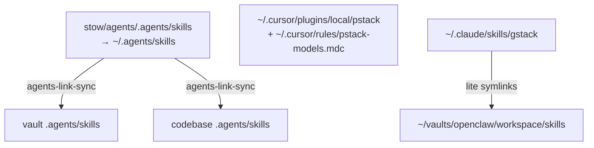

# Agents skill registry

Human map of **where skills live** and **where they end up** after Stow / link / host install.

Prefer this file for reading and planning. Prefer [links.registry](links.registry) for `make agents-link-sync` (machine rows only).

## Naming

| File | Role |
| --- | --- |
| **REGISTRY.md** (this file) | Human catalog: sources, end locations, ownership |
| **links.registry** | Make sync input: which targets get which hub skill symlinks |
| **skills-lock.json** | `npx skills` restore hashes for hub-vendored packs |
| **TOOLS.md** | Avoid here — OpenClaw/Hermes uses that name for *local runtime notes* (SSH, voice, cameras), not skill inventory |

## Surfaces (end locations)



| Surface | End location | How it gets there | Owned by |
| --- | --- | --- | --- |
| Coding hub | `~/.agents/skills/<name>/` | Stow from `stow/agents/.agents/skills/` | This package (git) |
| Vault fan-out | `<vault>/.agents/skills/<name>` → hub | `make agents-link-sync` | Symlink; hub is source |
| Code fan-out | `<repo>/.agents/skills/<name>` → hub | `make agents-link-sync` | Symlink; hub is source |
| Project-local | `<repo>/.agents/skills/<name>/` (real dirs) | `npx skills add …` in that repo | That repo |
| Vault-local | `~/vaults/personal/.agents/skills/<name>/` | Vault tooling (not Stow) | Vault |
| Cursor pstack | `~/.cursor/plugins/local/pstack/` (+ model rule) | Plugin install / local copy | Cursor home (not Stow) |
| gstack (Claude) | `~/.claude/skills/gstack/` | `git clone` + `./setup` | Claude home (not Stow) |
| gstack (OpenClaw lite) | `~/vaults/openclaw/workspace/skills/gstack-openclaw-*` | Symlink → gstack `openclaw/skills/` | Symlink |

After clone on a new machine:

```bash
make agents-install && make agents-verify
make agents-link-sync
# then: pstack + gstack host installs (see below) — not covered by Stow
```

---

## Hub skills (`~/.agents/skills`)

Canonical tree: `stow/agents/.agents/skills/` → stowed to `~/.agents/skills/`.

| Skill | Source | Summary |
| --- | --- | --- |
| ask-matt | [mattpocock/skills](https://www.skills.sh/mattpocock/skills) | Route work to the right skill or flow. |
| grill-me | [mattpocock/skills](https://www.skills.sh/mattpocock/skills) | Start a grilling session to stress-test a plan. |
| grilling | [mattpocock/skills](https://www.skills.sh/mattpocock/skills) | Interview the user and map a design tree. |
| grill-with-docs | [mattpocock/skills](https://www.skills.sh/mattpocock/skills) | Grill a plan and write ADRs and a glossary as you go. |
| tdd | [mattpocock/skills](https://www.skills.sh/mattpocock/skills) | Build test-first and keep tests that specify behavior. |
| diagnosing-bugs | [mattpocock/skills](https://www.skills.sh/mattpocock/skills) | Diagnose hard bugs and slow paths in a tight loop. |
| implement | [mattpocock/skills](https://www.skills.sh/mattpocock/skills) | Implement work from a spec or tickets. |
| handoff | [mattpocock/skills](https://www.skills.sh/mattpocock/skills) | Write a compact handoff for the next agent. |
| claude-handoff | [mattpocock/skills](https://www.skills.sh/mattpocock/skills) | Hand the session to a fresh Claude background agent. |
| code-review | [mattpocock/skills](https://www.skills.sh/mattpocock/skills) | Review a diff against standards and the spec. |
| improve-codebase-architecture | [mattpocock/skills](https://www.skills.sh/mattpocock/skills) | Find deepening refactors and report them. |
| writing-for-agents | [mattpocock/skills](https://www.skills.sh/mattpocock/skills) | Write skills and `AGENTS.md` that agents follow. |
| setup-matt-pocock-skills | [mattpocock/skills](https://www.skills.sh/mattpocock/skills) | Wire tracker, labels, and domain docs for this pack. |
| to-spec | [mattpocock/skills](https://www.skills.sh/mattpocock/skills) | Turn the current conversation into a tracker spec. |
| to-tickets | [mattpocock/skills](https://www.skills.sh/mattpocock/skills) | Split a plan into tracer-bullet tickets. |
| prototype | [mattpocock/skills](https://www.skills.sh/mattpocock/skills) | Build throwaway code to answer a design question. |
| research | [mattpocock/skills](https://www.skills.sh/mattpocock/skills) | Research a question from primary sources and write notes. |
| wayfinder | [mattpocock/skills](https://www.skills.sh/mattpocock/skills) | Map large work as decision tickets on the tracker. |
| resolving-merge-conflicts | [mattpocock/skills](https://www.skills.sh/mattpocock/skills) | Resolve an in-progress merge or rebase. |
| find-skills | [vercel-labs/skills](https://www.skills.sh/vercel-labs/skills/find-skills) | Discover and install skills from skills.sh. |
| skill-creator | [anthropics/skills](https://www.skills.sh/anthropics/skills/skill-creator) | Author, edit, and measure agent skills. |
| pr-description | Graduated (Trivelta) | Draft a concise PR body from branch context. |
| gh-stack | [github/gh-stack](https://www.skills.sh/github/gh-stack/gh-stack) | Manage stacked PRs with `gh stack`. Needs `gh extension install github/gh-stack`. Hub patch: compose with `pr-description` after submit. Re-apply the patch if you reinstall the skill. |
| ponytail | [DietrichGebert/ponytail](https://www.skills.sh/dietrichgebert/ponytail/ponytail) | Force the smallest solution that works (YAGNI). |
| ponytail-audit | [DietrichGebert/ponytail](https://www.skills.sh/dietrichgebert/ponytail/ponytail-audit) | Audit the whole repo for over-engineering. |
| ponytail-debt | [DietrichGebert/ponytail](https://www.skills.sh/dietrichgebert/ponytail/ponytail-debt) | List `ponytail:` comments as a debt ledger. |
| ponytail-gain | [DietrichGebert/ponytail](https://www.skills.sh/dietrichgebert/ponytail/ponytail-gain) | Show ponytail's measured impact scoreboard. |
| ponytail-help | [DietrichGebert/ponytail](https://www.skills.sh/dietrichgebert/ponytail/ponytail-help) | Show a one-shot reference for ponytail modes and commands. |
| ponytail-review | [DietrichGebert/ponytail](https://www.skills.sh/dietrichgebert/ponytail/ponytail-review) | Review a diff only for over-engineering. |
| product-description | [steveruizok gist](https://gist.github.com/steveruizok/83ae5c53f2784ebf8f5fe0a3fb94480f) | Write an outside-in product behavior spec. `npx skills` cannot clone this gist. Use the gist `install.sh` so `SKILL.md` sits beside `references/`. |
| show-me | [humanlayer/skills](https://www.skills.sh/humanlayer/skills/show-me) | Draw diagrams and focused HTML to explain the current topic. |

Restore hashes: [skills-lock.json](skills-lock.json).

---

## Fan-out from hub ([links.registry](links.registry))

Rows drive `make agents-link-sync`. Skills listed are **symlinks into** the target’s `.agents/skills/`.

| Kind | Target (end location) | Hub skills linked |
| --- | --- | --- |
| vault | `~/vaults/personal/.agents/skills/` | find-skills, skill-creator, pr-description (defaults) |
| code | `~/code/solopreneur/.agents/skills/` | grill-me, grilling, tdd, ask-matt, pr-description, gh-stack |
| code | `~/code/kamek-ai/.agents/skills/` | grill-me, tdd, ask-matt, find-skills, gh-stack — `hosts=personal` |
| vault | `~/vaults/openclaw/workspace/.agents/skills/` | find-skills, skill-creator — `hosts=personal` (Hermes) |

Missing targets are skipped. `hosts=personal` skips on work (`mbp14m4`); omit hosts = all machines.

Defaults if a row omits skills: vaults → `AGENTS_VAULT_SKILLS`; code → `AGENTS_CODE_SKILLS` (see root Makefile).

---

## Project-local skills (not hub-vendored)

Real directories in the repo (may sit beside hub symlinks).

### `~/code/kamek-ai/.agents/skills/`

| Skill | Origin | End location |
| --- | --- | --- |
| react-best-practices | vercel-labs/agent-skills | same path (project) |
| frontend-design | anthropics/skills | same |
| web-design-guidelines | vercel-labs/agent-skills | same |
| vercel-composition-patterns | vercel-labs/agent-skills | same |
| documentation-maintenance, improve, infra-vault, shadcn, stripe-* | project / other packs | same |

Plus hub symlinks from the table above.

### `~/code/solopreneur/.agents/skills/`

| Skill | Origin | End location |
| --- | --- | --- |
| domain-hunter, reddit, twitter | project-local | same |
| grill-me, grilling, tdd, ask-matt, pr-description, gh-stack | hub symlinks | → `~/.agents/skills/…` |

---

## Vault-local skills (`~/vaults/personal/.agents/skills/`)

Owned by the personal vault (not this package). Examples: `qmd`, `clip`, `kb-triage`, `job-scan`, `obsidian-*`, `vault-health`, …  

Hub fan-out only adds the symlink rows in [links.registry](links.registry); it does not move vault-owned skills into dotfiles.

---

## Cursor — pstack (outside Stow)

| Artifact | End location |
| --- | --- |
| Plugin skills / modes | `~/.cursor/plugins/local/pstack/` (or marketplace user install via `/add-plugin pstack`) |
| Model role map | `~/.cursor/rules/pstack-models.mdc` (`alwaysApply`) |
| Primary entry | `/poteto-mode` after `/setup-pstack` |

Preferred long-term: marketplace `/add-plugin pstack` for account sync. Local plugin dir is fine for immediate use.

Do not vendor full pstack into this hub.

Entry points only. Remaining `principle-*` and other pstack skills live in the plugin. `/poteto-mode` typically pulls them in. This registry does not list them.

| Skill | Source | Summary |
| --- | --- | --- |
| `/setup-pstack` | [pstack](https://github.com/cursor/plugins/blob/main/pstack/skills/setup-pstack/SKILL.md) | Configure which model each pstack role uses. |
| `/poteto-mode` | [pstack](https://github.com/cursor/plugins/blob/main/pstack/skills/poteto-mode/SKILL.md) | Primary workflow for non-trivial Cursor work. It invokes many skills for you. |
| `/create-verification-skill` | [pstack](https://github.com/cursor/plugins/blob/main/pstack/skills/create-verification-skill/SKILL.md) | Create a project verification skill so the agent can run, control, and debug the app. Trusted agent loop. |
| `/maintain-verification-skill` | [pstack](https://github.com/cursor/plugins/blob/main/pstack/skills/maintain-verification-skill/SKILL.md) | Keep the verification skill and feature map sharp. Use daily automation, a grok bot, or Cursor automation. |
| `/show-me-your-work` | [pstack](https://github.com/cursor/plugins/blob/main/pstack/skills/show-me-your-work/SKILL.md) | Write a TSV decision trail for unattended or long runs. |
| `/how` | [pstack](https://github.com/cursor/plugins/blob/main/pstack/skills/how/SKILL.md) | Walk through the current design before you change it. |
| `/why` | [pstack](https://github.com/cursor/plugins/blob/main/pstack/skills/why/SKILL.md) | Capture design rationale and postmortems. |
| `/architect` | [pstack](https://github.com/cursor/plugins/blob/main/pstack/skills/architect/SKILL.md) | Sketch types and signatures before you write code. |
| `/arena` | [pstack](https://github.com/cursor/plugins/blob/main/pstack/skills/arena/SKILL.md) | Run parallel candidates and graft the winners. |
| `/swarm` | [pstack](https://github.com/cursor/plugins/blob/main/pstack/skills/swarm/SKILL.md) | Fan out parallel workers and return one report. |
| `/interrogate` | [pstack](https://github.com/cursor/plugins/blob/main/pstack/skills/interrogate/SKILL.md) | Run an adversarial multi-model review. |
| `/tdd` | [pstack](https://github.com/cursor/plugins/blob/main/pstack/skills/tdd/SKILL.md) | Use when the user asks for TDD or failing tests. |
| `/unslop` | [pstack](https://github.com/cursor/plugins/blob/main/pstack/skills/unslop/SKILL.md) | Cut AI tells from writing. |

Verification recs: [poteto tweet](https://x.com/poteto/status/2093414407196012990).

Example feature map: [poteto/verification-skill-example](https://github.com/poteto/verification-skill-example).

---

## Future mastermind — gstack (outside Stow)

Provisional OpenClaw workspace; migrate host to Hermes when ready (`./setup --host hermes`).

| Artifact | End location |
| --- | --- |
| Full suite | `~/.claude/skills/gstack/` (`./setup`) |
| OpenClaw lite | `~/vaults/openclaw/workspace/skills/gstack-openclaw-{office-hours,ceo-review,investigate,retro}` → gstack `openclaw/skills/` |
| Dispatch rules | `~/vaults/openclaw/workspace/AGENTS.md` § Coding Tasks |

Do not vendor whole gstack into `stow/agents` (keeps the coding hub lean).

---

## Keep out of this registry

- Trivelta-only skills (`pam-permissions`, `athena-clickhouse-parity`, …) — stay on `mbp14m4` project trees
- Vendor / `.venv` skills
- Secrets and live `~/.cursor` / `~/.claude` trees (except documented install paths above)

## Maintenance

1. Add or graduate a hub skill → update this file + [skills-lock.json](skills-lock.json) + optionally [TODO.md](TODO.md).
2. Link it into vaults/code → edit [links.registry](links.registry), run `make agents-link-sync`, refresh the fan-out table here.
3. Project-only pack → document under **Project-local**; do not add to the hub unless it graduates.
